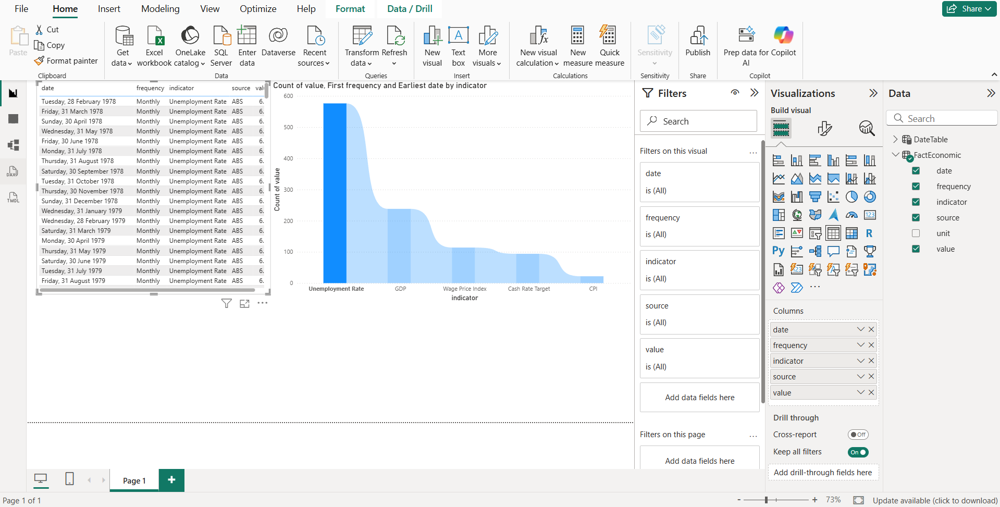
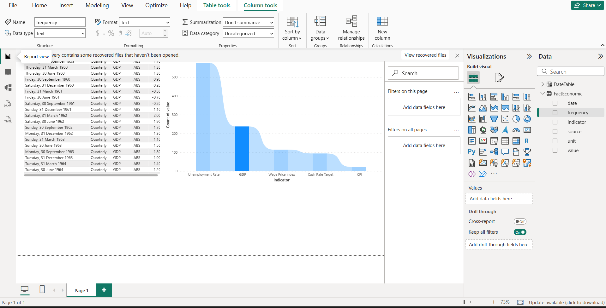
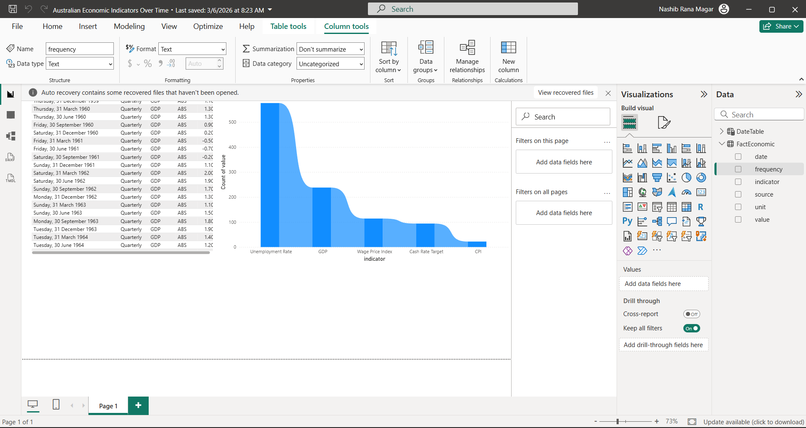

# Australia Economic Pulse Dashboard

> **Automated AU macro-indicators pipeline** — Python ETL pulls live data from the ABS & RBA, builds a tidy weekly dataset, and powers an interactive Power BI dashboard. Fully automated via GitHub Actions with zero manual steps.

An automated Python ETL pipeline that pulls Australian macroeconomic data from the ABS and RBA, cleans it into a Power BI-ready dataset, and refreshes it weekly via GitHub Actions.

---

## What This Project Does

| Layer | What happens |
|---|---|
| **Extract** | Python scripts download the latest Excel files from ABS and RBA |
| **Transform** | `build_dataset.py` parses headers dynamically, normalises dates by frequency, and outputs one tidy CSV |
| **Load** | Power BI connects to `data/clean/economic_indicators.csv` for visualisation |
| **Automate** | A GitHub Actions workflow runs every Monday, commits updated data back to the repo |

---

## Data Sources

| Indicator | Source | Series | Frequency |
|---|---|---|---|
| Consumer Price Index (CPI) | Australian Bureau of Statistics | Cat. 6401.0 | Quarterly |
| Unemployment Rate | Australian Bureau of Statistics | Cat. 6202.0 | Monthly |
| Wage Price Index (WPI) | Australian Bureau of Statistics | Cat. 6345.0 | Quarterly |
| Gross Domestic Product (GDP) | Australian Bureau of Statistics | Cat. 5206.0 | Quarterly |
| Cash Rate Target | Reserve Bank of Australia | Table A2 | Monthly |

All datasets are sourced directly from official government portals and are freely available.

---

## Output Dataset Schema

`data/clean/economic_indicators.csv`

| Column | Type | Description |
|---|---|---|
| `date` | Date (YYYY-MM-DD) | Period-end date — month-end for monthly series, quarter-end for quarterly |
| `indicator` | Text | Series name (e.g. `CPI All Groups`, `Unemployment Rate`) |
| `value` | Number | Observation value |
| `unit` | Text | Unit of measure (e.g. `Percent`, `Index`, `$ Million`) |
| `frequency` | Text | `Monthly` or `Quarterly` |
| `source` | Text | `ABS` or `RBA` |

---

## Run Locally

**Requirements:** Python 3.12+, Power BI Desktop (optional, for dashboard)

```bash
# 1. Create and activate a virtual environment
python -m venv .venv
.venv\Scripts\Activate.ps1    # Windows — PowerShell
.venv\Scripts\activate.bat   # Windows — CMD
source .venv/bin/activate     # macOS/Linux

# 2. Install dependencies
pip install -r requirements.txt

# 3. Download raw data
python scripts/fetch_abs.py
python scripts/fetch_rba.py

# 4. Build the clean dataset
python scripts/build_dataset.py
```

Output: `data/clean/economic_indicators.csv`

**Debug mode** — prints detected sheet layout and series descriptions for each ABS file:

```bash
DEBUG_ABS=1 python scripts/build_dataset.py   # macOS/Linux
$env:DEBUG_ABS="1"; python scripts/build_dataset.py  # PowerShell
```

---

## Automation

The workflow in [.github/workflows/update-data.yml](.github/workflows/update-data.yml) runs **every Monday at 01:00 UTC** and can also be triggered manually from the Actions tab.

**What it does:**
1. Checks out the repository
2. Installs Python 3.12 and dependencies
3. Runs `fetch_abs.py` → `fetch_rba.py` → `build_dataset.py` in order
4. Commits updated files in `data/raw/` and `data/clean/` back to `main`
5. Exits with code 1 (fails the run) if any download or extraction step fails

---

## Power BI Dashboard





*Connect Power BI Desktop to `data/clean/economic_indicators.csv` using Get Data → Text/CSV.*

---

## Dashboard Features

- **CPI trend** — quarterly inflation trajectory with year-on-year change
- **Unemployment rate** — monthly labour market conditions over time
- **Wage growth vs inflation** — dual-axis WPI vs CPI comparison
- **GDP growth** — quarterly chain volume measure with period-on-period growth
- **Cash rate timeline** — RBA monetary policy decisions over the economic cycle
- **Date slicer** — filter all visuals to any custom date range

---

## Technologies Used

| Tool | Role |
|---|---|
| Python 3.12 | Data extraction and transformation |
| pandas | Data cleaning and reshaping |
| requests | HTTP downloads from ABS and RBA |
| openpyxl / xlrd | Parsing `.xlsx` and `.xls` Excel files |
| GitHub Actions | Scheduled weekly pipeline execution |
| Power BI | Interactive dashboard and visualisation |

---

## Repository Structure

```
aus-economic-pulse/
├── .github/
│   └── workflows/
│       └── update-data.yml           # Weekly GitHub Actions workflow
├── data/
│   ├── raw/                          # Downloaded source Excel files (auto-generated)
│   └── clean/
│       └── economic_indicators.csv  # Final Power BI dataset
├── scripts/
│   ├── fetch_abs.py                  # Downloads ABS datasets
│   ├── fetch_rba.py                  # Downloads RBA datasets
│   └── build_dataset.py             # Cleans and merges all indicators
└── requirements.txt
```

---

## Future Improvements

- Add housing approvals, retail trade, and business confidence indicators
- Publish `economic_indicators.csv` as a GitHub Pages static asset for Power BI web connector access
- Add data validation to flag anomalous values before committing
- Send a notification if a download or extraction step fails

---

## Data Licences

- ABS data: [Creative Commons Attribution 4.0](https://www.abs.gov.au/website-privacy-copyright-and-disclaimer)
- RBA data: [Creative Commons Attribution 4.0](https://www.rba.gov.au/copyright/)
